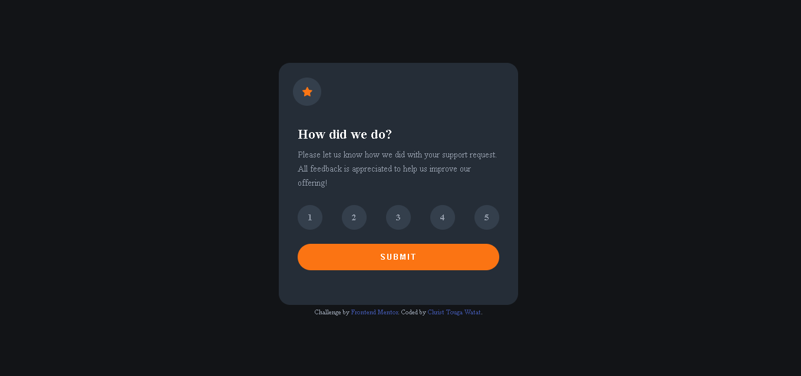
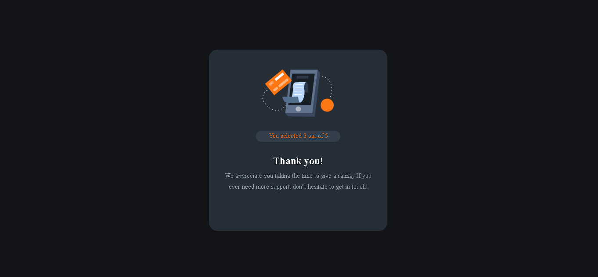

# Frontend Mentor - Interactive rating component solution

This is a solution to the [Interactive rating component challenge on Frontend Mentor](https://www.frontendmentor.io/challenges/interactive-rating-component-koxpeBUmI). Frontend Mentor challenges help you improve your coding skills by building realistic projects. 

## Table of contents

- [Overview](#overview)
  - [The challenge](#the-challenge)
  - [Screenshot](#screenshot)
  - [Links](#links)
- [My process](#my-process)
  - [Built with](#built-with)
  - [What I learned](#what-i-learned)
  - [Continued development](#continued-development)
  - [Useful resources](#useful-resources)
- [Author](#author)

## Overview

### The challenge

Users should be able to:

- View the optimal layout for the app depending on their device's screen size
- See hover states for all interactive elements on the page
- Select and submit a number rating
- See the "Thank you" card state after submitting a rating

### Screenshot




### Links

- Solution URL: [Add solution URL here](https://your-solution-url.com)
- Live Site URL: [Add live site URL here](https://your-live-site-url.com)

## My process

### Built with

- Semantic HTML5 markup
- CSS custom properties
- Flexbox
- Mobile-first workflow

### What I learned

```js
   getData() {              // use different html files in one script file
        let page = document.body.id;
        switch(page) {
            case "user_start":
                this.getNumbers();
                break;
            
            case "user_end":
                this.printNumbers();
                break;
                
            case "default":
                break;
        }
              
       if(button) {
            button.addEventListener("click", () => {
                window.open("index2.html", "_self");
            })
        }
             
              
              localStorage.setItem("selected", selected);
              localStorage.setItem("selected", 0);
              localStorage.getItem("selected", selected);
```

### Continued development

- HTML accessibility
- HTML SEO
- semantic HTML
- css-grid
- javascript

### Useful resources

- [OpenJavascript] (https://www.youtube.com/watch?v=x0VcigW9kN0) - Pass a Variable Value from One HTML Page to Another.
- [Nosa Obaseki] (https://blog.logrocket.com/localstorage-javascript-complete-guide/#:~:text=Use%20the%20clear()%20method,does%20not%20receive%20any%20parameters.) - brieve introduction  to localStorage, sessionStorage and other properties of window
- [Anna Fritzgerald] (https://blog.hubspot.com/website/center-div-css) - 11 ways to align text in container
- [Elaine Leung] (https://codepen.io/elaineleung/pen/RwMqMxZ) - A better solution thant the one I had before

## Author

- LinkedIn - [Christ-Kevin](https://www.linkedin.com/in/christ-k%C3%A9vin-touga-watat-32026712a)
- Frontend Mentor - [@Christ-Kevin](https://www.frontendmentor.io/profile/Christ-Kevin)
